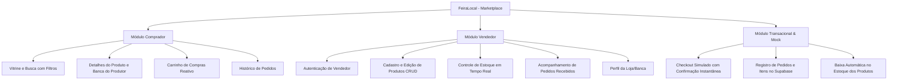

# Documento de Visão do Projeto — FeiraLocal

**Curso:** Bacharelado em Sistemas de Informação — Faculdade Multivix  
**Disciplina:** Projeto Interdisciplinar / Engenharia de Software  
**Projeto:** FeiraLocal — Marketplace Digital para Pequenos Produtores e Artesãos  
**Versão:** 1.0  
**Data:** 2026-08-26  

---

## 1. Introdução

### 1.1 Finalidade
O presente documento tem por finalidade descrever a visão geral, objetivos estratégicos, escopo, público-alvo, stakeholders e diferenciais competitivos da plataforma **FeiraLocal**. Este projeto visa aproximar consumidores conscientes de pequenos produtores agrícolas e artesãos locais através de um marketplace digital inclusivo, acessível e transparente.

### 1.2 Contexto e Oportunidade
Feirantes, agricultores familiares e artesãos enfrentam constantes barreiras para divulgar seus produtos e alcançar consumidores fora do horário e espaço físico das feiras livres tradicionais. Ao mesmo tempo, grandes marketplaces globais impõem taxas elevadas, burocracias de integração e logística complexa, desfavorecendo o comércio hiperlocal. O **FeiraLocal** surge para preencher essa lacuna, proporcionando uma vitrine digital simples e direta para o comércio de proximidade.

---

## 2. Posicionamento do Produto

### 2.1 Declaração do Problema

| Elemento | Descrição |
| :--- | :--- |
| **O problema de** | Dificuldade de comercialização e baixa visibilidade digital de produtores locais e artesãos. |
| **Afeta** | Pequenos produtores familiares, feirantes, artesãos e a comunidade consumidora local. |
| **Cujo impacto é** | Dependência exclusiva de vendas em feiras físicas pontuais, desperdício de itens perecíveis e menor renda para famílias produtoras. |
| **Uma solução de sucesso seria** | Uma plataforma web intuitiva que permita aos produtores catalogarem seus itens e gerenciarem estoque, enquanto compradores locais encontram produtos frescos e artesanais com facilidade. |

### 2.2 Declaração de Posição do Produto

| Elemento | Descrição |
| :--- | :--- |
| **Para** | Pequenos produtores rurais, artesãos e consumidores que valorizam o comércio local. |
| **Que** | Necessitam de um canal direto, simples e sem intermediários predatórios para comprar e vender produtos artesanais e hortifrúti. |
| **O FeiraLocal** | É um marketplace digital comunitário e intuitivo. |
| **Que** | Conecta a banca do feirante ao smartphone/computador do cliente, com catálogo filtrado, carrinho e simulação de checkout transparente. |
| **Diferente de** | Grandes plataformas de e-commerce genéricas e redes sociais desestruturadas. |
| **Nosso produto** | Foca no comércio hiperlocal de proximidade, simplicidade de uso para o produtor e valorização da cultura e economia regional. |

---

## 3. Descrição dos Stakeholders e Usuários

### 3.1 Resumo dos Stakeholders

| Stakeholder | Papel no Projeto | Interesses Principais |
| :--- | :--- | :--- |
| **Associação de Feirantes / Produtores** | Entidade representativa / Cliente simulated | Ampliar a renda dos associados e modernizar o acesso à feira. |
| **Equipe de Desenvolvimento (6 Integrantes)** | Planejamento, arquitetura, codificação, testes e deploy | Aplicação de práticas ágeis Scrum, entrega de valor contínua e excelência técnica. |
| **Corpo Docente (Multivix)** | Avaliação acadêmica e técnica | Cumprimento de prazos, conformidade com os entregáveis de Engenharia de Software e qualidade do software. |

### 3.2 Perfis de Usuário

#### A. O Pequeno Produtor / Artesão (Vendedor)
- **Perfil:** Feirante ou artesão com pouco tempo e familiaridade tecnológica variável.
- **Necessidades:** Cadastrar produtos rapidamente pelo celular ou computador, alterar preços, atualizar quantidade em estoque e acompanhar pedidos recebidos.
- **Critério de Sucesso:** Painel descomplicado, sem excesso de configurações técnicas.

#### B. O Consumidor Local (Comprador)
- **Perfil:** Morador da região que prefere alimentos agroecológicos, frescos e artesanato exclusivo.
- **Necessidades:** Visualizar o que está disponível na feira da semana, pesquisar por categoria (ex: queijos, mel, verduras, cestarias), adicionar à cesta e realizar pedidos de forma rápida.
- **Critério de Sucesso:** Interface ágil, busca precisa e transparência na visualização dos itens.

---

## 4. Visão Geral do Produto e Recursos Principais

---

## 5. Restrições do Projeto

1. **Restrição Orçamentária:** Utilização exclusiva de serviços em planos gratuitos (*Free Tier* do Supabase e Vercel).
2. **Restrição de Pagamento:** Operação de pagamento **simulada** (mock de gateway com aprovação instantânea), sem transações financeiras reais em conformidade com as diretrizes acadêmicas.
3. **Prazos:** Desenvolvimento orientado a Sprints quinzenais com rodízio de papéis no Scrum.
4. **Segurança:** Implementação obrigatória de **Row Level Security (RLS)** em todas as tabelas do banco de dados Postgres no Supabase.

---

## 6. Métricas de Sucesso do Projeto

- **Tempo de carregamento da vitrine:** Inferior a 1,5 segundos (Core Web Vitals).
- **Usabilidade:** Taxa de conclusão de compra simulada superior a 90% em testes com usuários externos.
- **Cobertura de Requisitos:** 100% dos itens priorizados como *Must Have* no MoSCoW implementados e validados.
