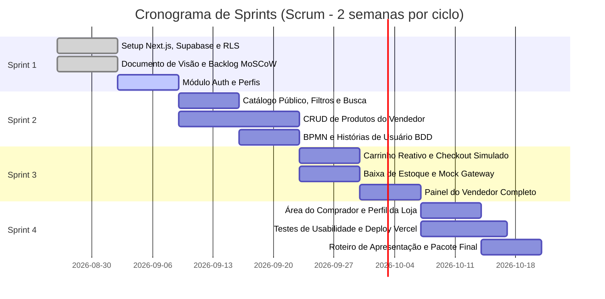

# Backlog do Produto, EAP e Priorização MoSCoW — FeiraLocal

**Curso:** Bacharelado em Sistemas de Informação — Faculdade Multivix  
**Disciplina:** Engenharia de Software / Projeto Interdisciplinar  
**Projeto:** FeiraLocal  
**Versão:** 1.0  
**Data:** 2026-08-26  

---

## 1. Estrutura Analítica do Projeto (EAP / WBS)

```mermaid
graph TD
    P[1. Projeto FeiraLocal]
    
    P --> G1[1.1 Gestão e Requisitos]
    G1 --> G11[1.1.1 Documento de Visão]
    G1 --> G12[1.1.2 Backlog MoSCoW & Sprints]
    G1 --> G13[1.1.3 Especificação de Histórias de Usuário]
    G1 --> G14[1.1.4 Mapeamento BPMN]

    P --> D1[1.2 Modelagem e Arquitetura]
    D1 --> D11[1.2.1 MER e Dicionário de Dados]
    D1 --> D12[1.2.2 Arquitetura de Software e Diagrama de Classes]
    D1 --> D13[1.2.3 Políticas de Segurança RLS]

    P --> F1[1.3 Desenvolvimento Frontend & Backend]
    F1 --> F11[1.3.1 Módulo Autenticação e Perfis]
    F1 --> F12[1.3.2 Módulo Catálogo e Busca]
    F1 --> F13[1.3.3 Módulo Carrinho e Checkout Simulado]
    F1 --> F14[1.3.4 Módulo Painel do Vendedor & Estoque]
    F1 --> F15[1.3.5 Módulo Área do Comprador]

    P --> Q1[1.4 Qualidade, Testes e Implantação]
    Q1 --> Q11[1.4.1 Plano de Testes Funcionais]
    Q1 --> Q12[1.4.2 Teste de Usabilidade Externo]
    Q1 --> Q13[1.4.3 Deploy em Nuvem Vercel + Supabase]
    Q1 --> Q14[1.4.4 Roteiro de Apresentação e Vídeo]
```

---

## 2. Priorização do Backlog (Método MoSCoW)

A metodologia MoSCoW foi aplicada para categorizar as entregas de acordo com a criticidade para o MVP acadêmico e viabilidade técnica no ciclo de desenvolvimento.

### 2.1 Must Have (Obrigatório / Essencial para a Entrega)

| ID | Item do Backlog | Descrição | Story Points | Sprint |
| :--- | :--- | :--- | :---: | :---: |
| **US-01** | Autenticação Supabase | Cadastro e login de usuários (comprador e vendedor) integrando `auth.users` e `usuarios`. | 5 | Sprint 1 |
| **US-02** | Perfil do Vendedor | Criação automática da loja/banca com nome, bio e cidade na tabela `vendedores`. | 3 | Sprint 1 |
| **US-03** | CRUD de Produtos | Vendedor pode criar, listar, editar e inativar seus produtos com preço, categoria e estoque. | 8 | Sprint 2 |
| **US-04** | Catálogo Público com Filtros | Comprador visualiza produtos ativos, filtra por categoria e pesquisa por nome. | 5 | Sprint 2 |
| **US-05** | Carrinho de Compras | Adição/remoção de itens com cálculo automático do subtotal e persistência local. | 5 | Sprint 3 |
| **US-06** | Checkout Simulado (Mock) | Finalização de compra simulada gravando em `pedidos`, `itens_pedido`, `pagamentos` com status 'aprovado'. | 8 | Sprint 3 |
| **US-07** | Baixa Automática de Estoque | Ao confirmar o pedido simulado, o estoque (`estoque_qtd`) dos itens é decrementado atomicamente. | 5 | Sprint 3 |
| **US-08** | Painel de Gestão do Vendedor | Vendedor visualiza métricas de faturamento simulado, pedidos recebidos e alerta de estoque baixo. | 8 | Sprint 3 |
| **US-09** | Políticas de RLS | Row Level Security ativo em 100% das tabelas do Supabase garantindo isolamento de dados. | 5 | Sprint 1 |

### 2.2 Should Have (Importante / Alto Valor Agregado)

| ID | Item do Backlog | Descrição | Story Points | Sprint |
| :--- | :--- | :--- | :---: | :---: |
| **US-10** | Página Pública da Loja | Rota `/loja/[id]` exibindo a bio do produtor e todos os seus produtos disponíveis. | 3 | Sprint 4 |
| **US-11** | Área "Meus Pedidos" | Comprador consulta histórico de compras com detalhamento de itens e status. | 5 | Sprint 4 |
| **US-12** | Modal de Detalhes do Produto | Visualização rápida de foto expandida, dados do produtor e estoque disponível. | 3 | Sprint 2 |
| **US-13** | Opções de Pagamento Mock | Interface interativa simulando Pix com QR Code, Cartão de Crédito e Dinheiro. | 3 | Sprint 3 |
| **US-14** | Toast Notifications | Alertas visuais e sonoros para ações (item adicionado, erro de validação, sucesso). | 2 | Sprint 2 |

### 2.3 Could Have (Desejável / Se houver tempo hábil)

| ID | Item do Backlog | Descrição | Story Points | Sprint |
| :--- | :--- | :--- | :---: | :---: |
| **US-15** | Avaliação e Comentários | Sistema de estrelas (1 a 5) e feedback para produtos após a compra simulada. | 5 | Backlog |
| **US-16** | Modo Escuro (Dark Mode) | Alternância de tema claro/escuro com persistência de preferência do usuário. | 3 | Sprint 4 |
| **US-17** | Compartilhamento Social | Botão para compartilhar link do produto ou banca no WhatsApp. | 2 | Sprint 4 |

### 2.4 Won't Have (Fora do Escopo desta Versão)

| ID | Item do Backlog | Justificativa |
| :--- | :--- | :--- |
| **W-01** | Gateway de Pagamento Real | Proibido pelo escopo acadêmico; adotado gateway mock simulado. |
| **W-02** | Rastreamento GPS de Entregadores | Complexidade logística excessiva para o prazo do projeto. |
| **W-03** | Aplicativo Nativo (iOS/Android) | Foco em Progressive Web App (PWA) responsivo via Next.js. |

---

## 3. Planejamento das Sprints (Scrum — 2 semanas por sprint)

