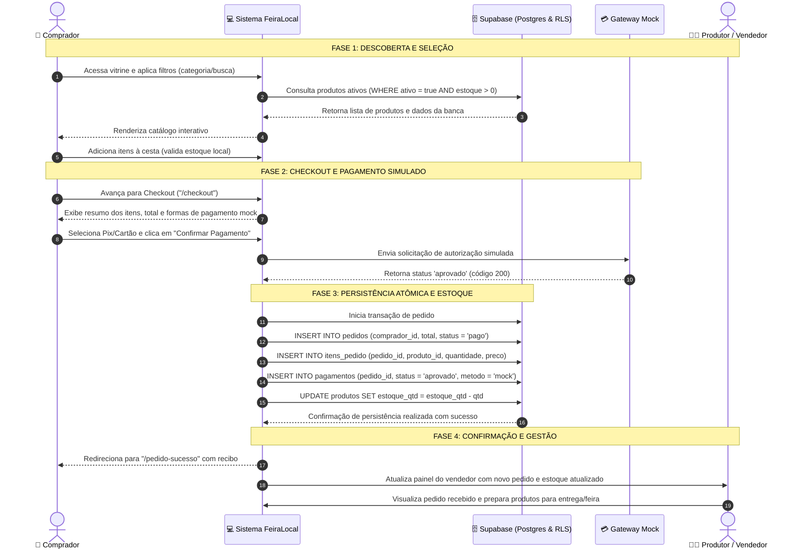

# Diagrama BPMN do Processo de Compra Ponta a Ponta — FeiraLocal

**Curso:** Bacharelado em Sistemas de Informação — Faculdade Multivix  
**Disciplina:** Modelagem de Processos de Negócio / Engenharia de Software  
**Projeto:** FeiraLocal  
**Versão:** 1.0  
**Data:** 2026-08-26  

---

## 1. Visão Geral do Processo de Negócio

O processo de compra no **FeiraLocal** envolve a integração contínua entre o consumidor final, o catálogo digital reativo, o motor de pagamento simulado e o painel de gestão do produtor rural. A seguir é apresentado o mapeamento em padrão BPMN (Business Process Model and Notation) detalhado com raias de responsabilidade.

---

## 2. Diagrama de Fluxo Ponta a Ponta (BPMN / Swimlanes)

---

## 3. Detalhamento das Fases do BPMN

### 3.1 Fase de Descoberta e Seleção
- **Evento Inicial:** O comprador acessa a vitrine pública do FeiraLocal no navegador.
- **Atividades:**
  - O sistema busca no Supabase apenas os produtos com `ativo = true`.
  - O comprador utiliza a barra de pesquisa em tempo real ou clica nas categorias (ex: *Hortifrúti*, *Queijos*, *Doces*, *Artesanato*).
  - O comprador insere a quantidade desejada no carrinho. O sistema valida se a quantidade não ultrapassa `estoque_qtd`.

### 3.2 Fase de Checkout e Pagamento Simulado (Mock)
- **Atividades:**
  - O comprador acessa a tela de checkout e visualiza o subtotal detalhado.
  - Seleciona o método de pagamento simulado (Pix com QR Code mock, Cartão simulado ou Pagamento na Entrega).
  - Clica em **"Confirmar Pagamento"**.
  - O serviço `PaymentMockService` simula o processamento do gateway com tempo de resposta de 500ms e retorna imediatamente a aprovação (`status = 'aprovado'`).

### 3.3 Fase de Gravação e Baixa no Estoque
- **Atividades:**
  - O sistema gera o registro do pedido com UUID único e status `'pago'`.
  - Os itens do pedido são gravados na tabela `itens_pedido` registrando o preço unitário daquele instante.
  - O registro de pagamento mock é associado ao pedido na tabela `pagamentos`.
  - A quantidade comprada é subtraída do campo `estoque_qtd` de cada produto na tabela `produtos`.

### 3.4 Fase de Conclusão e Gestão da Produção
- **Evento Final Comprador:** Apresentação da tela de sucesso com número de confirmação, lista de produtos e link para acompanhar em "Meus Pedidos".
- **Evento Final Vendedor:** O pedido aparece no painel do produtor, e o gráfico de faturamento simulado e alertas de estoque são recalculados.
