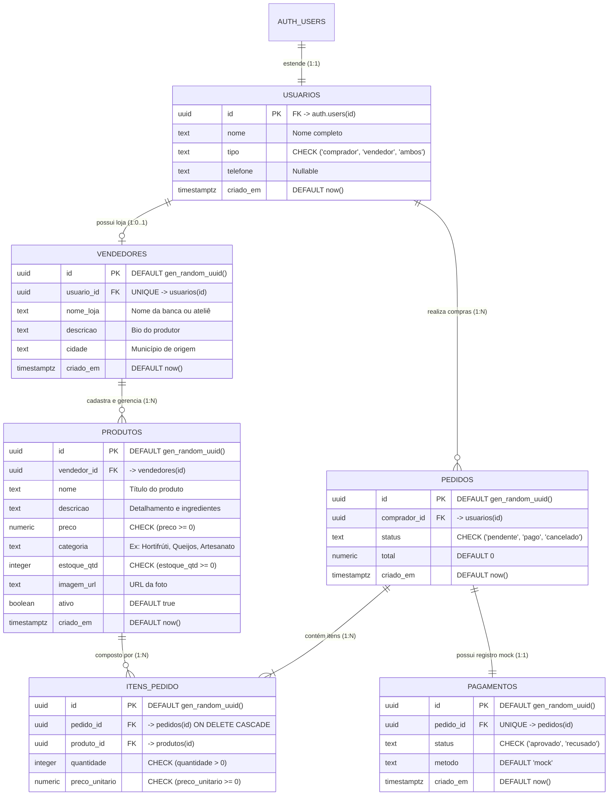

# Modelagem de Dados: MER, DER e Políticas RLS — FeiraLocal

**Curso:** Bacharelado em Sistemas de Informação — Faculdade Multivix  
**Disciplina:** Banco de Dados / Engenharia de Software  
**Projeto:** FeiraLocal  
**Banco de Dados Alvo:** PostgreSQL (Supabase `hzccqgzcttjsemshbqey`, região us-west-2)  
**Versão:** 1.0  
**Data:** 2026-08-26  

---

## 1. Diagrama Entidade-Relacionamento (DER Relacional)

---

## 2. Dicionário de Dados Detalhado

### 2.1 Tabela `usuarios`
Estende os usuários autenticados do `auth.users` do Supabase com metadados do aplicativo.

| Campo | Tipo | Nulidade | Padrão | Descrição / Restrição |
| :--- | :--- | :---: | :---: | :--- |
| `id` | `UUID` | **NÃO** | - | Chave Primária. FK referenciando `auth.users(id)` com integridade referencial em cascata. |
| `nome` | `TEXT` | **NÃO** | - | Nome civil ou fantasia do usuário cadastrado. |
| `tipo` | `TEXT` | **NÃO** | `'comprador'` | Tipo do perfil. `CHECK (tipo IN ('comprador', 'vendedor', 'ambos'))`. |
| `telefone` | `TEXT` | SIM | `NULL` | Telefone / WhatsApp para contato da feira. |
| `criado_em` | `TIMESTAMPTZ` | **NÃO** | `now()` | Timestamp de registro no sistema. |

---

### 2.2 Tabela `vendedores`
Armazena a banca, ateliê ou agroindústria familiar do produtor.

| Campo | Tipo | Nulidade | Padrão | Descrição / Restrição |
| :--- | :--- | :---: | :---: | :--- |
| `id` | `UUID` | **NÃO** | `gen_random_uuid()` | Chave Primária única da banca/loja. |
| `usuario_id` | `UUID` | **NÃO** | - | FK única referenciando `usuarios(id)`. Garante 1 loja por usuário vendedor. |
| `nome_loja` | `TEXT` | **NÃO** | - | Nome da banca, agroindústria ou ateliê artesanal. |
| `descricao` | `TEXT` | SIM | `NULL` | História da família, selo de orgânico ou descrição da produção. |
| `cidade` | `TEXT` | SIM | `NULL` | Município do produtor (ex: Vitória, Domingos Martins, Santa Teresa). |
| `criado_em` | `TIMESTAMPTZ` | **NÃO** | `now()` | Data de criação da banca. |

---

### 2.3 Tabela `produtos`
Catálogo de produtos físicos oferecidos pelos produtores locais.

| Campo | Tipo | Nulidade | Padrão | Descrição / Restrição |
| :--- | :--- | :---: | :---: | :--- |
| `id` | `UUID` | **NÃO** | `gen_random_uuid()` | Chave Primária única do produto. |
| `vendedor_id` | `UUID` | **NÃO** | - | FK referenciando `vendedores(id)`. |
| `nome` | `TEXT` | **NÃO** | - | Nome comercial do produto. |
| `descricao` | `TEXT` | SIM | `NULL` | Detalhes, modo de cultivo ou medidas artesanais. |
| `preco` | `NUMERIC(10,2)` | **NÃO** | - | Preço unitário em BRL. `CHECK (preco >= 0)`. |
| `categoria` | `TEXT` | SIM | `NULL` | Categoria de agrupamento (Hortifrúti, Queijos, Doces, Artesanato, etc.). |
| `estoque_qtd` | `INTEGER` | **NÃO** | `0` | Quantidade física disponível. `CHECK (estoque_qtd >= 0)`. |
| `imagem_url` | `TEXT` | SIM | `NULL` | Link da imagem armazenada no Supabase Storage ou URL pública. |
| `ativo` | `BOOLEAN` | **NÃO** | `true` | Se `true`, exibe na vitrine pública. Se `false`, oculto para compradores. |
| `criado_em` | `TIMESTAMPTZ` | **NÃO** | `now()` | Data de cadastro. |

---

### 2.4 Tabela `pedidos`
Cabeçalho das ordens de compra efetuadas.

| Campo | Tipo | Nulidade | Padrão | Descrição / Restrição |
| :--- | :--- | :---: | :---: | :--- |
| `id` | `UUID` | **NÃO** | `gen_random_uuid()` | Chave Primária do pedido. |
| `comprador_id` | `UUID` | **NÃO** | - | FK referenciando `usuarios(id)` do comprador. |
| `status` | `TEXT` | **NÃO** | `'pendente'` | `CHECK (status IN ('pendente', 'pago', 'cancelado'))`. |
| `total` | `NUMERIC(10,2)` | **NÃO** | `0.00` | Valor total monetário do pedido. |
| `criado_em` | `TIMESTAMPTZ` | **NÃO** | `now()` | Timestamp da compra. |

---

### 2.5 Tabela `itens_pedido`
Itens vinculados a cada pedido.

| Campo | Tipo | Nulidade | Padrão | Descrição / Restrição |
| :--- | :--- | :---: | :---: | :--- |
| `id` | `UUID` | **NÃO** | `gen_random_uuid()` | Chave Primária do item no pedido. |
| `pedido_id` | `UUID` | **NÃO** | - | FK referenciando `pedidos(id)`. |
| `produto_id` | `UUID` | **NÃO** | - | FK referenciando `produtos(id)`. |
| `quantidade` | `INTEGER` | **NÃO** | - | Quantidade de unidades compradas. `CHECK (quantidade > 0)`. |
| `preco_unitario` | `NUMERIC(10,2)` | **NÃO** | - | Preço congelado no momento da compra. `CHECK (preco_unitario >= 0)`. |

---

### 2.6 Tabela `pagamentos` (Mock)
Registro transacional do gateway simulado.

| Campo | Tipo | Nulidade | Padrão | Descrição / Restrição |
| :--- | :--- | :---: | :---: | :--- |
| `id` | `UUID` | **NÃO** | `gen_random_uuid()` | Chave Primária da transação. |
| `pedido_id` | `UUID` | **NÃO** | - | FK UNIQUE referenciando `pedidos(id)`. |
| `status` | `TEXT` | **NÃO** | `'aprovado'` | `CHECK (status IN ('aprovado', 'recusado'))`. |
| `metodo` | `TEXT` | **NÃO** | `'mock'` | Identificador do método simulado (ex: pix, cartao, mock). |
| `criado_em` | `TIMESTAMPTZ` | **NÃO** | `now()` | Timestamp da confirmação. |

---

## 3. Índices de Otimização no Banco

Os seguintes índices foram criados para garantir alta performance nas consultas em larga escala:
- `CREATE INDEX idx_produtos_vendedor ON produtos(vendedor_id);` — Acelera busca dos produtos no painel do produtor.
- `CREATE INDEX idx_produtos_categoria ON produtos(categoria);` — Otimiza filtragem por categoria na vitrine.
- `CREATE INDEX idx_pedidos_comprador ON pedidos(comprador_id);` — Agiliza carregamento do histórico do comprador.
- `CREATE INDEX idx_itens_pedido_pedido ON itens_pedido(pedido_id);` — Otimiza join dos itens do pedido.

---

## 4. Políticas de Row Level Security (RLS)

O banco de dados opera com **RLS Habilitado** em 100% das tabelas:
1. **usuarios:** Leitura e edição restritas ao próprio usuário autenticado (`auth.uid() = id`).
2. **vendedores:** Leitura aberta ao público para visualização das bancas; escrita/edição restrita ao proprietário (`auth.uid() = usuario_id`).
3. **produtos:** Leitura pública permitida para produtos com `ativo = true`; vendedores possuem permissão de gerenciamento total (INSERT, UPDATE, DELETE) sobre seus próprios produtos (`vendedor_id IN (SELECT id FROM vendedores WHERE usuario_id = auth.uid())`).
4. **pedidos:** Compradores visualizam apenas seus pedidos; vendedores visualizam pedidos que contenham itens vinculados à sua banca.
5. **itens_pedido & pagamentos:** Visibilidade restrita aos participantes legítimos do pedido correspondente.
