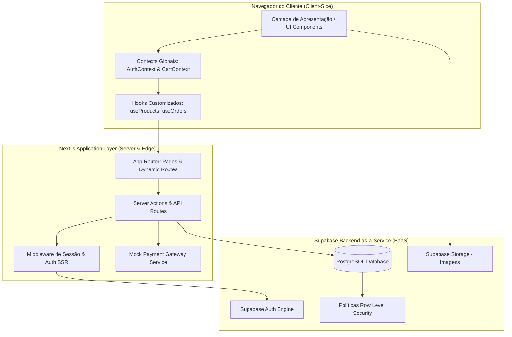
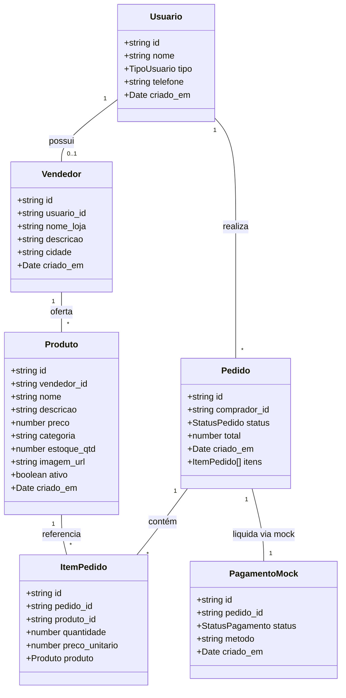

# Diagrama e Especificação de Arquitetura de Software — FeiraLocal

**Curso:** Bacharelado em Sistemas de Informação — Faculdade Multivix  
**Disciplina:** Arquitetura e Padrões de Software / Engenharia de Software  
**Projeto:** FeiraLocal  
**Stack:** Next.js 15 (App Router, Server & Client Components), TypeScript, Tailwind CSS, Supabase (PostgreSQL + Auth + RLS)  
**Versão:** 1.0  
**Data:** 2026-08-26  

---

## 1. Visão Geral da Arquitetura em Camadas

A arquitetura do **FeiraLocal** foi concebida seguindo o padrão **Clean Architecture / Layered Architecture** adaptado ao ecossistema moderno do Next.js (App Router) com integração Serverless ao Supabase.



---

## 2. Estrutura de Diretórios e Pacotes

```text
src/
├── app/                        # Camada de Roteamento (App Router)
│   ├── (auth)/                 # Grupo de rotas de autenticação
│   │   ├── login/page.tsx
│   │   └── cadastro/page.tsx
│   ├── painel/                 # Área restrita do Vendedor
│   │   ├── layout.tsx          # Sidebar e verificação de role
│   │   ├── page.tsx            # Dashboard de métricas
│   │   ├── produtos/page.tsx   # Gestão de produtos & estoque
│   │   ├── pedidos/page.tsx    # Pedidos recebidos pelo produtor
│   │   └── perfil/page.tsx     # Edição dos dados da banca
│   ├── carrinho/page.tsx       # Cesta de compras do cliente
│   ├── checkout/page.tsx       # Checkout simulado com gateway mock
│   ├── pedido-sucesso/[id]/    # Recibo e confirmação do pedido
│   ├── meus-pedidos/page.tsx   # Histórico de compras do comprador
│   ├── produtos/[id]/page.tsx  # Página detalhada do produto
│   ├── loja/[id]/page.tsx      # Vitrine exclusiva do produtor
│   ├── layout.tsx              # Root layout (Navbar, Providers, Footer)
│   ├── page.tsx                # Vitrine principal e catálogo com filtros
│   └── globals.css             # Design tokens e Tailwind CSS
├── components/                 # Componentes Visuais Reutilizáveis
│   ├── layout/                 # Navbar, Footer, Sidebar
│   ├── ui/                     # Button, Card, Badge, Modal, Input, Toast
│   ├── produtos/               # ProductCard, ProductGrid, ProductFilter
│   ├── carrinho/               # CartDrawer, CartItem, OrderSummary
│   └── painel/                 # MetricCard, ProductModal, StockBadge
├── contexts/                   # Estado Global da Aplicação
│   ├── AuthContext.tsx         # Sessão, usuário ativo e perfil (comprador/vendedor)
│   └── CartContext.tsx         # Itens do carrinho, contadores e persistência
├── lib/                        # Integrações e Serviços
│   ├── supabase/
│   │   ├── client.ts           # Cliente Supabase para Browser Components
│   │   ├── server.ts           # Cliente Supabase para Server Actions
│   │   └── middleware.ts       # Validador de cookies de sessão
│   ├── services/
│   │   ├── mockPayment.ts      # Gateway de pagamento simulado
│   │   ├── productService.ts   # Operações de catálogo e estoque
│   │   └── orderService.ts     # Gravação atômica de pedidos
│   └── utils.ts                # Formatadores de moeda (BRL), datas e classes
└── types/                      # Definições de Tipos TypeScript
    └── database.ts             # Interfaces tipadas espelhando o banco
```

---

## 3. Diagrama de Classes e Entidades TypeScript



---

## 4. Padrão de Mock do Gateway de Pagamento

Para assegurar o desacoplamento e cumprir o requisito acadêmico sem expor transações financeiras reais, o sistema implementa a interface `PaymentGatewayService`:

```typescript
export interface PaymentResult {
  sucesso: boolean;
  transacaoId: string;
  metodo: 'pix' | 'cartao' | 'dinheiro' | 'mock';
  mensagem: string;
}

export class MockPaymentGateway {
  static async processarPagamento(pedidoId: string, valor: number, metodo: string): Promise<PaymentResult> {
    // Simula latência de rede realista (400ms)
    await new Promise((resolve) => setTimeout(resolve, 400));
    
    return {
      sucesso: true,
      transacaoId: `mock_${Date.now()}`,
      metodo: (metodo as any) || 'mock',
      mensagem: "Pagamento simulado aprovado com sucesso!",
    };
  }
}
```
