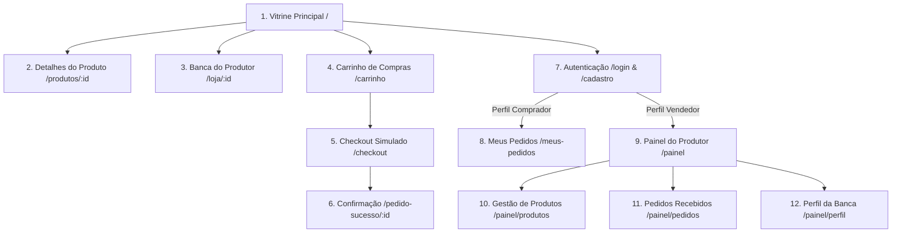

# Protótipo de Interface de Alta Fidelidade e Design System — FeiraLocal

**Curso:** Bacharelado em Sistemas de Informação — Faculdade Multivix  
**Disciplina:** Design de Interação / IHC (Interação Humano-Computador)  
**Projeto:** FeiraLocal  
**Versão:** 1.0  
**Data:** 2026-08-26  

---

## 1. Identidade Visual e Design System

O FeiraLocal adota uma estética voltada à natureza, sustentabilidade e tradição artesanal, combinada com a precisão dos componentes de software de alta performance.

### 1.1 Paleta de Cores

| Cor / Token | Código Hexadecimal | Significado e Aplicação |
| :--- | :---: | :--- |
| **Verde Floresta (Primary 700)** | `#15803d` | Cor principal de destaque: botões de ação, badges de sucesso, frescor orgânico. |
| **Verde Esmeralda (Primary 600)** | `#16a34a` | Estados hover, destaques de preço e confirmação de estoque disponível. |
| **Terracota / Âmbar (Amber 600)** | `#d97706` | Acentos de calor, categorias de artesanato e alerta de estoque baixo. |
| **Linho Orgânico (Earth 100)** | `#f2e8e5` | Fundos secundários suaves e cartões destacados. |
| **Background Claro** | `#fcfbfa` | Fundo principal diurno com sensação de papel artesanal limpo. |
| **Background Noturno** | `#0f172a` | Fundo no modo escuro profundo com alto contraste. |
| **Texto Primário** | `#1e293b` | Legibilidade máxima em textos e cabeçalhos. |

---

## 2. Mapa de Telas e Navegação

---

## 3. Especificação das Telas Principais

### 3.1 Tela 1: Vitrine Principal (`/`)
- **Header:** Logotipo FeiraLocal, busca rápida, indicador do perfil ativo, botão do carrinho com contador pulsante.
- **Hero Banner:** Slogan *"Direto da feira para a sua mesa — Apoie produtores e artesãos locais"*, com botão de ação para compras e atalho para quem deseja vender.
- **Carrossel de Categorias:** Pílulas visuais com ícones para Hortifrúti, Queijos, Panificação, Doces, Artesanato e Bebidas.
- **Grid de Produtos:** Cards com foto em alta resolução, badge de categoria, nome do produtor e cidade, preço em destaque e botão de adição rápida à cesta.

### 3.2 Tela 2: Carrinho e Checkout Simulado (`/carrinho` e `/checkout`)
- Resumo claro dos produtos com fotos, quantidades ajustáveis e subtotal calculado em tempo real.
- Seletor de pagamento mock com visual intuitivo:
  - **Pix Simulado:** Exibição de QR Code ilustrativo e chave de teste "Copia e Cola".
  - **Cartão Simulado:** Campos formatados para teste de cartão com botão de preenchimento automático.
  - **Pagamento na Entrega:** Opção de dinheiro/máquina na retirada.
- Botão proeminente *"Confirmar Pagamento Simulado"*.

### 3.3 Tela 3: Painel do Vendedor (`/painel`)
- **Cards de Métricas:** Faturamento simulado acumulado, quantidade de pedidos no mês, itens ativos e avisos de estoque baixo.
- **Tabela de Gestão de Estoque:** Listagem rápida com ajuste inline de quantidade (+/-) e switch de ativação rápida.
- **Modal de Cadastro/Edição de Produto:** Formulário estruturado com upload/link de foto, nome, descrição, categoria e validações numéricas de preço e estoque.
