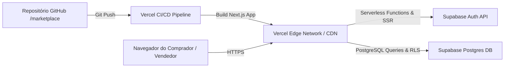

# Roteiro e Relato de Implantação em Nuvem (Vercel + Supabase) — FeiraLocal

**Curso:** Bacharelado em Sistemas de Informação — Faculdade Multivix  
**Disciplina:** Implantação e Operações (DevOps) / Projeto Interdisciplinar  
**Projeto:** FeiraLocal  
**Provedor de Hospedagem:** Vercel (Frontend & Serverless Edge)  
**Provedor de Banco & Auth:** Supabase (`hzccqgzcttjsemshbqey`, região us-west-2)  
**Versão:** 1.0  
**Data:** 2026-08-26  

---

## 1. Arquitetura de Implantação em Nuvem Gratuita

A estratégia de implantação do **FeiraLocal** utiliza uma arquitetura JAMstack / Serverless 100% gratuita (*Hobby / Free Tier*), garantindo alta performance, CDN global e zero custo de infraestrutura:

---

## 2. Passo a Passo de Implantação na Vercel

### Passo 1: Conectar o Repositório GitHub à Vercel
1. Acesse o painel da [Vercel](https://vercel.com) e efetue login com sua conta do GitHub.
2. Clique no botão **"Add New..."** -> **"Project"**.
3. Localize e selecione o repositório `ronald-cussati/marketplace` e clique em **"Import"**.

### Passo 2: Configuração de Build e Variáveis de Ambiente
1. No campo **Framework Preset**, selecione **Next.js** (detectado automaticamente).
2. Na seção **Environment Variables**, adicione as seguintes chaves:

| Nome da Variável | Valor Configurado |
| :--- | :--- |
| `NEXT_PUBLIC_SUPABASE_URL` | `https://hzccqgzcttjsemshbqey.supabase.co` |
| `NEXT_PUBLIC_SUPABASE_ANON_KEY` | *(Chave `anon public` obtida no painel do Supabase)* |
| `NEXT_PUBLIC_SITE_NAME` | `FeiraLocal` |
| `NEXT_PUBLIC_SITE_DESCRIPTION` | `Marketplace digital para pequenos produtores e artesãos locais` |

3. Clique em **"Deploy"**.

### Passo 3: Validação da URL Pública
- A Vercel executará o pipeline automatizado de compilação TypeScript, otimização de imagens e empacotamento Serverless.
- Ao concluir, será disponibilizada a URL de produção (ex: `https://marketplace-local.vercel.app` ou similar).

---

## 3. Relato de Implantação e Boas Práticas Adotadas

1. **Deploy Contínuo (CI/CD):** Qualquer commit ou pull request integrado à branch `main` dispara automaticamente um novo build e deploy atômico com zero downtime.
2. **Certificado SSL / HTTPS:** Emitido e renovado automaticamente pela Vercel com criptografia ponta a ponta.
3. **Isolamento de Credenciais:** As chaves de serviço nunca são expostas no código versionado, sendo lidas exclusivamente via variáveis de ambiente seguras.
